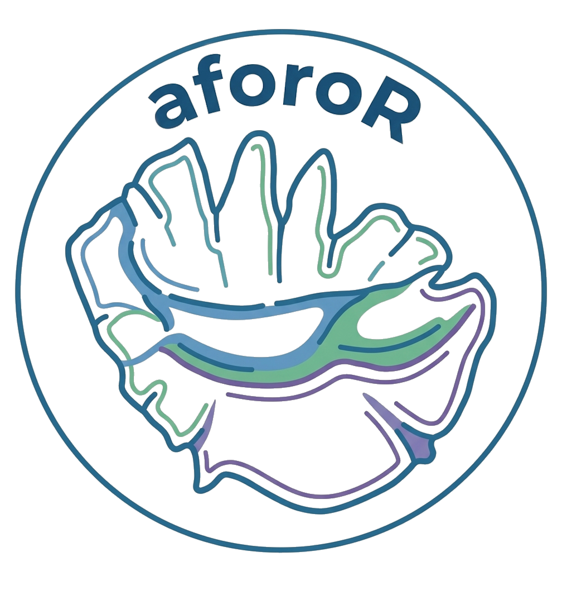

# aforoR 

[](https://github.com/oterium/aforoR)
[](https://github.com/oterium/aforoR/blob/main/LICENSE)
[](https://cran.r-project.org/)
[](https://github.com/oterium/aforoR)

## Shape Analysis of Fish Otoliths
### *Anàlisi de FORmes d'Otòlits in R*

This package has been developed for **Shape Analysis of Fish Otoliths** following the methodology established by the *AFORO* team (Parisi-Baradad et al., 2005). It includes functions to extract coordinates, elliptic Fourier descriptors, and wavelets at multiple scales; and and different tutorials about its application. Comparable information is available through the *AFORO* website (**Anàlisi de FORmes d'Otòlits**, <http://aforo.cmima.csic.es/index.jsp>; Lombarte et al., 2006), although only on an image-by-image basis. The package can also be applied to other closed biological structures, including limpets, leaves, statoliths, and beaks (Tuset et al., 2020; Varsa et al., 2025).

**Common applications**

-   Species identification (taxonomy, diversity, evolution, paleoecology and trophic ecology)
-   Stock differentiation (fisheries)
-   Modelling ontogenetic changes (ecomorphology)
-   Phenotype detection (fisheries, ecomorphology and evolution)

The **Overview** includes essential guidelines on otolith morphology and the interpretation of wavelets. The **Applications** offers tutorials on extracting contour data (coordinates, elliptic fourier descriptors and wavelets at different scales), and the mathematical protocol use for the wavelet analysis. It also provides tutorials for otolith morphometric analysis. The **Publications** list scientific literature cited.

## Installation

``` r
## Install the development version from GitHub:
install.packages("devtools")
devtools::install_github("oterium/aforoR")
```

## Getting started

``` r
## Load package
library(aforoR)
```

To obtain correctly results, users need:

-   a **folder** with the images (\*.jpg or \*tif)
-   a **matrix** of biological data (columns) and specimens (row). These specimens must have the same name that images.
-   a **matrix** of otolith data (length, width, area and perimeter) for all specimens.These specimens must have the same name that images.

Before extracting the contour, please read **Overview** to assess whether your images are suitable.

### Workflow

1. Image Preprocessing
2. Contour Extraction
3. Distance Measurements
4. Wavelet decomposition
5. Visualization and Export


## Citation

Please cite this package as: Otero-Ferrer, J.L., Tuset, V.M., Manjabacas, A., Lombarte, A. (2025). *aforoR*: Anàlisi de FORmes d'Otòlits/Shape Analysis of Fish Otoliths. R package version 0.1.0. <https://github.com/oterium/aforoR>. See `CITATION.cff` for Zenodo-ready metadata.

## Contributions

JLOF, VMT, AM an AL coded the functions and their help. JLOF, and VMT led tutorial writings. All authors tested the functions and contributed to writing of helps and tutorials. JLOF optimized the package.

---

<div align="center">

**🐟 Happy Otolith Analysis! 🐟**

*Made with ❤️ for the fisheries science community*

[](https://github.com/oterium/aforoR)

</div>
