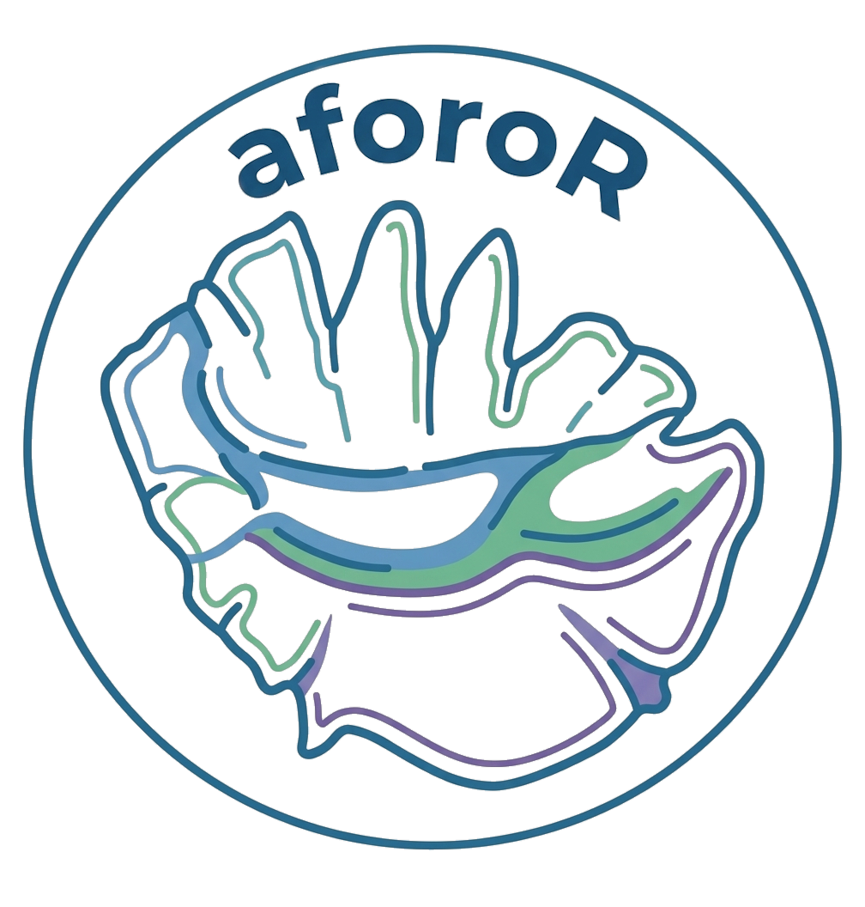

# aforoR 

**Shape Analysis of Fish Otoliths**  
*Anàlisi de FORmes d’Otòlits in R*

<br clear="right"/>

[](https://github.com/oterium/aforoR)
[](https://github.com/oterium/aforoR/blob/main/LICENSE)
[](https://cran.r-project.org/)
[](https://oterium.github.io/aforoR)
[](https://github.com/oterium/aforoR/actions/workflows/R-CMD-check.yaml)
[](https://doi.org/10.5281/zenodo.18449478)

------------------------------------------------------------------------

### Overview

**aforoR** is an R package designed for high-precision **Shape Analysis
of Fish Otoliths**. It implements the methodology established by the
*AFORO* team (Parisi-Baradad et al., 2005), providing a complete
workflow from image preprocessing.

While specifically optimized for otoliths, the package is equally
powerful for analyzing other closed biological structures such as
leaves, statoliths, beaks, and shells.

### Key Features

- **Automatic Scale Detection**: Automatically identifies 1mm scale bars
  in images to convert pixel measurements to physical units (mm).
- **Advanced Morphometrics**: Comprehensive calculation of geometric
* **Basic Morphometrics**: Computation of basic geometric measures (Area, Perimeter, Length, Width).
- **Multi-scale Wavelet Analysis**: Decomposition of contours using
  discrete wavelet transforms for detailed frequency-based shape
  characterization.
- **Elliptic Fourier Descriptors (EFDs)**: Standard Fourier-based shape
  analysis.
- **Curvature Scale Space (CSS)**: Geometric approach for detecting
  inflection points at multiple smoothing scales.
- **Optimal Point Selection**: Implementation of the Hall &
  Bathia (2012) algorithm for identifying the most discriminative points
  in functional data.
- **Batch Processing**: Efficiently process entire directories of images
  with automated output generation.

------------------------------------------------------------------------

### Installation

``` r
# Install development version from GitHub
if (!require("devtools")) install.packages("devtools")
devtools::install_github("oterium/aforoR")

# Load the package
library(aforoR)
```

### Quick Start

The easiest way to use **aforoR** is the `process_images` function,
which automates the entire analysis pipeline for a folder containing
supported image files (`.jpg`, `.jpeg`, `.png`, `.tif`, `.tiff`).

``` r
library(aforoR)

# 1. Define your working directory with images
my_images <- "path/to/your/images"

# 2. Run the automated pipeline
# This will perform: Preprocessing -> Scale Detection -> Contour -> Wavelets -> Morphometrics
process_images(
  folder = my_images,
  detect_scale = TRUE,   # Automatically find 1mm scale bars
  wavelets = TRUE,       # Compute wavelet coefficients
  ef = TRUE,             # Compute Elliptic Fourier Descriptors
  save = TRUE,           # Export results as CSV files
  testing = TRUE         # Generate diagnostic visualizations
)
```

------------------------------------------------------------------------

### Learning Resources (Vignettes)

The package includes detailed tutorials (vignettes) to guide you through
different analytical scenarios:

#### AFORO Classic

| Tutorial | Description |
|:---|:---|
| [**Comparing Shape Descriptors**](https://oterium.github.io/aforoR/articles/Shape_Descriptors.html) | Comparison between EFD, Wavelets, and CSS for otolith analysis. |
| [**Image Preprocessing & Contour Extraction**](https://oterium.github.io/aforoR/articles/Obtaining_Contour.html) | Introduction to the core image processing, orientation, and contour extraction workflow. |
| [**Wavelet Theory & Fundamentals**](https://oterium.github.io/aforoR/articles/Knowing_Wavelets.html) | Technical background on wavelet transform and scales. |
| [**Population Discrimination with Wavelets**](https://oterium.github.io/aforoR/articles/Working_Wavelets.html) | Deep dive into wavelet-based population comparison, PCA, and classification models. |

#### AFORO Experimental

| Tutorial | Description |
|:---|:---|
| [**Detecting Shape Phenotypes**](https://oterium.github.io/aforoR/articles/Phenotypes.html) | Detection of different phenotypes based on shape clustering. |
| [**Lobe Analysis with Wavelets**](https://oterium.github.io/aforoR/articles/Analyzing_Lobes.html) | Specialized analysis of specific morphological features (lobes). |
| [**Optimal Point Selection (Hall & Bathia)**](https://oterium.github.io/aforoR/articles/Point_Selection.html) | Sequential point selection for classification using the Hall & Bathia ML algorithm. |
| [**Applications of Otolith Size**](https://oterium.github.io/aforoR/articles/Otolith_Morphometry.html) | Guide to calculating basic morphometric measures and modeling allometric relationships. |

#### Bibliography

| Resource | Description |
|:---|:---|
| [**References**](https://oterium.github.io/aforoR/articles/References.html) | Bibliography and datasets used in the package. |

------------------------------------------------------------------------

### Citation

If you use **aforoR** in your research, please cite it as:

Otero-Ferrer, J.L., Tuset, V.M., Manjabacas, A., Lombarte, A. (2026).
*aforoR*: Anàlisi de FORmes d’Otòlits / Shape Analysis of Fish Otoliths.
R package version 0.2.0. <https://github.com/oterium/aforoR>

### Acknowledgments

Developed by **JLOF, VMT, AM, and AL**. Based on the
[AFORO](http://aforo.cmima.csic.es/) methodology for marine science and
morphological research.

<div align="center">

<br>
<p>

<b>Happy Otolith Analysis!</b>
</p>

<sub>Made for the fisheries science community</sub> <br><br>
<a href="https://github.com/oterium/aforoR">

</a>

</div>
