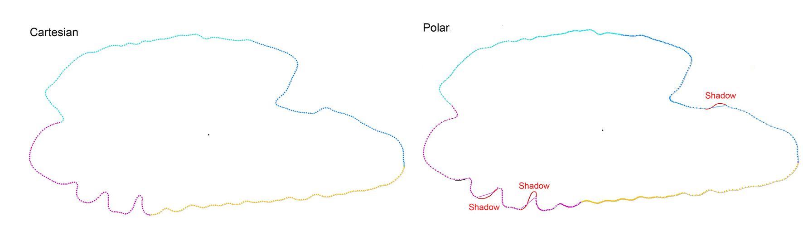

## About this tutorial

This tutorial describes the basic concepts underlying the morphological interpretation of wavelet functions.

## Choosing coordinates

The package extracts the contour in both Cartesian and polar coordinates. The selection of the coordinate system depends on the degree of contour irregularity: the greater the irregularity, the higher the probability of misrepresentation (‘shadowing’) when using polar coordinates.

| Coordinates | Advantages | Disadvantages |
|:-----------------:|:---------------------------:|:-----------------------:|
| Cartesian | Irregular shapes with acute angles | Points are not strictly homologous |
| Polar | Perfect for round shapes or few irregularity | Points are homologous |

{width="21cm"}

## Towards wavelet representation

The package extracts 512 equidistant coordinates from each orthogonal projection of the otolith. These coordinates enable the calculation of the normalized distance from the centroid to the chosen initial point, from which the wavelet transform is computed at multiple scales. Lower scales (1^st^) capture finest contour irregularities, whereas higher scales (9^th^) smooth the outline (Parisi-Baradad et al., 2015; Vasconcelos et al., 2025).

Visualizing coordinates and distances allows for the reconstruction of contours and the identification of irregular shapes. Users have access to all scales, with the choice of scale determined by the specific study and the structure of the otolith margins. We recommend the following:

-   Species identification: 5^th^ level,
-   Stock separation: 4^th^ level,
-   Phenotype discrimination: 2^nd^ to 4^th^ levels,
-   Organism classification: 6^th^ to 8^th^ levels.

## Morphological interpretation of wavelets

The wavelet function is obtained in a counter-clockwise direction. The package provides two types of graphics in the output R:

-   **Image type 1:** Wavelet signal.
-   **Image type 2:** Contour points and reconstructed outline.

Check these graphics for possible issues with images or backgrounds. Images are divided into four colour-coded sections (1–128, 129–256, 257–374, 375–512) to aid morphological interpretation.

By applying the wavelet function to the otolith contour, users can readily reconstruct the otolith morphology.

