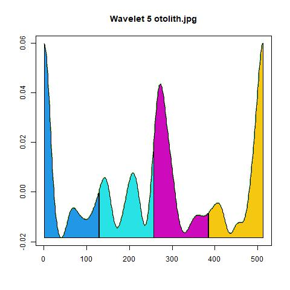

```{r setup, include = FALSE}
knitr::opts_chunk$set(
  collapse = TRUE,
  comment = "#>"
)
```

## About this tutorial

This tutorial describes how to use the `aforoR` package to process images, extract otolith contours, and calculate shape descriptors including Elliptic Fourier Descriptors (EFDs), Wavelets, and Shape Indices.

## 1. Setting up images

The package works by processing all `.jpg` images within a specified folder. While we use sample images for this tutorial, full datasets of *Aphanopus carbo* and *A. intermedius* (as used in other vignettes) can be downloaded from Zenodo:

> [!NOTE]
> **Zenodo Dataset**: [Aphanopus Otolith Images](https://zenodo.org/api/records/18443318/draft/files/images.zip/content)

First, let's look at where the example image is stored:

```{r image_setup}
library(aforoR)

# Locate the example image
image_path <- system.file("extdata", "otolith.jpg", package = "aforoR")

# Fallback if the package is not installed but we are running vignettes locally
if (image_path == "") {
  image_path <- file.path("../inst/extdata", "otolith.jpg")
}

# Create a temporary directory for processing
work_dir <- file.path(tempdir(), "aforo_tutorial")
if (dir.exists(work_dir)) unlink(work_dir, recursive = TRUE)
dir.create(work_dir)

# Copy the example image to the working directory
file.copy(image_path, file.path(work_dir, "otolith.jpg"))

cat("Working directory:", work_dir, "\n")
list.files(work_dir)
```

## 2. Processing images

The main function `process_images` handles the entire workflow:
1.  **Preprocessing**: Grayscale conversion, filtering, and binarization.
2.  **Contour Extraction**: Identifies the otolith boundaires.
3.  **Feature Calculation**: Computes distances, wavelets, and EFDs.
4.  **Morphometrics**: Calculates indices like Circularity, Roundness, etc.

You can specify the scale of your images using the `pixels_per_mm` argument to get measurements in millimeters.

```{r process}
# Run the processing pipeline
# We set pixels_per_mm = 100 as an example scale (100 pixels = 1 mm)
process_images(
  folder = work_dir,
  threshold = NULL, # Automatic thresholding (Otsu)
  wavelets = TRUE, # Calculate wavelets
  ef = TRUE, # Calculate Elliptic Fourier Descriptors
  pixels_per_mm = 100 # define scale
)
```

## 3. Examining Results

The function creates two subdirectories: `Polar` (Polar coordinates) and `Cartesian` (Perimeter coordinates).

### 3.1 Morphometric Indices

A new file `MorphometricsEN.csv` is created containing geometric measurements and shape indices.

```{r morpho_results}
morpho_file <- file.path(work_dir, "Polar", "MorphometricsEN.csv")
if (file.exists(morpho_file)) {
  morpho_data <- read.table(morpho_file, header = TRUE, sep = ";", dec = ".")
  knitr::kable(morpho_data, caption = "Morphometric Indices")
}
```

The indices include:
*   **Area**: Area of the otolith ($mm^2$).
*   **Perimeter**: Perimeter length ($mm$).
*   **Length / Width**: Major and minor axis dimensions ($mm$).
*   **Shape Indices**: Roundness, Circularity, Rectangularity, Aspect Ratio, etc. (Unitless).

### 3.2 Wavelet Coefficients

The wavelet analysis results are saved in multiple CSV files corresponding to different scales.

```{r wavelet_results}
wavelet_file <- file.path(work_dir, "Polar", "Wavelet_5EN.csv")
if (file.exists(wavelet_file)) {
  wave5 <- read.table(wavelet_file, header = FALSE, sep = ";", dec = ".")

  # Display first few columns
  knitr::kable(wave5[, 1:10], caption = "Wavelet Scale 5 (First 10 columns)")
}
```


### 3.3 Visualizations

The package automatically generates diagnostic images to verify the contour extraction and analysis zones.

#### Zonal Analysis
This image shows the original binary otolith with the centroid (black dot), the starting point of the contour (red dot), and the angular sectors used for analysis (colored lines).

{width="80%"}

#### Wavelet Transform
This plot visualizes the wavelet coefficients at a specific scale (default: scale 5). It highlights how different parts of the contour contribute to the shape complexity.

{width="80%"}


(Images are saved in the `Polar` folder).

