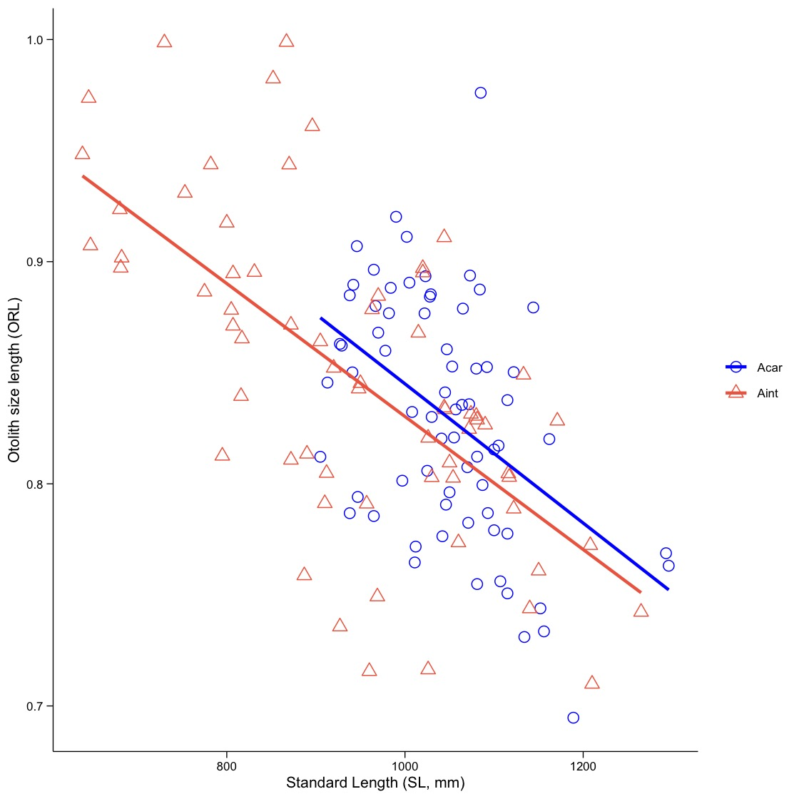
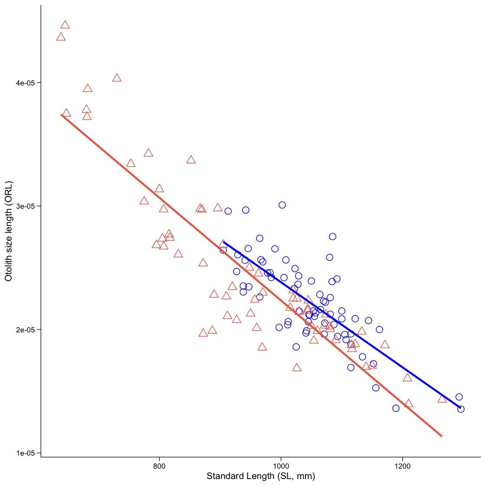

## About this tutorial

This tutorial is dedicated to provide examples that illustrate alternative approaches to morphometric analyses.

## 1. Shape Indices (Tuset et al.)

The `aforoR` package provides a straightforward way to calculate standard otolith shape indices widely used in literature (e.g., Tuset et al., 2003). These indices help in characterizing the geometry of the otolith and are useful for species identification or stock discrimination.

The function `calculate_morphometrics` (or the pipeline `process_images`) computes:

*   **Roundness**: $(4 \cdot Area) / (\pi \cdot Length^2)$
*   **Form Factor**: $(4 \pi \cdot Area) / Perimeter^2$
*   **Circularity**: $Perimeter^2 / Area$
*   **Rectangularity**: $Area / (Length \cdot Width)$
*   **Ellipticity**: $(Length - Width) / (Length + Width)$
*   **Aspect Ratio**: $Length / Width$

When providing the `pixels_per_mm` argument, the Area, Perimeter, Length, and Width are converted to real-world units (mm and mm²).

```r
# Example of calculating morphometrics for a single contour
# Assuming 'contour' is a data frame with X and Y columns
metrics <- calculate_morphometrics(contour, pixels_per_mm = 100)
print(metrics)
```

## 2. Fish-otolith length relationship

**Linear models must not be used**. Only power models **Y=*a*X^*b*^** has **biologically meaningful** (Lleonart et al., 1993). Parameter estimation can be performed using log-linear or non-linear regression (NLS). Example with NLS (Giménez et al., 2016; Tuset et al., in press).

``` r
#using Aphanopus dataset
fit_allometric_Species <- Aphanopus %>%
  group_by(Species) %>%
  do({
    # Fit the allometric model: fish length = a * OL^b. SL = standard length
    fit <- tryCatch({
      nls_model <- nls(SL ~ a * OL^b, data = ., start = list(a = 10, b = 0.1))# start points must be checked.
      # Return the fitted model as a tibble
      tibble(Species = unique(.$Species), a = coef(nls_model)["a"], b = coef(nls_model)["b"], success = TRUE)}, error = function(e) {
      # If fitting fails, return NA for parameters and FALSE for success
      tibble(Species = unique(.$Species), a = NA, b = NA, success = FALSE)
    })
    fit
  })
fit_allometric_Species
right_fits <- fit_allometric_Species %>%
  filter(success == TRUE)
  
  # Fit the null model (SL = a) for each species (group)
fit_null_Species <- Aphanopus %>%
  group_by(Species) %>%
  do({
    # Try to fit the null model: SL = a (just the mean of SL)
    fit <- tryCatch({
      # Estimate the mean of SL for each group as the intercept
      a <- mean(.$SL, na.rm = TRUE)
      # Return the estimate as a tibble
      tibble(Species = unique(.$Species), a = a, success = TRUE)
    }, error = function(e) {
      # If fitting fails, return NA for a and success = FALSE
      tibble(Species = unique(.$Species), a = NA, success = FALSE)
    })
    fit
  })

# View the results of the null model fitting
fit_null_Species
right_fits_null <- fit_null_Species %>%
  filter(success == TRUE)

# Assuming that 'model' is the correct name of the column in fit_allometric_Species
deviance_results <- fit_allometric_Species %>%
  left_join(fit_null_Species, by = "Species") %>%
  mutate(
  # Calculate the residuals for the allometric model: SL - (a * OL^b)
    deviance_model = sapply(Species, function(species) {
      # Get the values of a and b for the current species
      species_data <- Aphanopus %>% filter(Species == species)
      a_value <- first(filter(fit_allometric_Species, Species == species)$a)
      b_value <- first(filter(fit_allometric_Species, Species == species)$b)
      sum((species_data$SL - (a_value * species_data$OL^b_value))^2, na.rm = TRUE)
    }),
    
    # Calculate the residuals for the null model: SL - a (from the null model)
    deviance_null = sapply(Species, function(species) {
      # Get the value of a for the current species from the null model
      species_data <- Aphanopus %>% filter(Species == species)
      a_value <- first(filter(fit_null_Species, Species == species)$a)
      sum((species_data$SL - a_value)^2, na.rm = TRUE)
    }),
    
    # Calculate the percentage deviance improvement
    percentage_deviance = ifelse(
      !is.na(deviance_model) & !is.na(deviance_null) & deviance_null != 0,
      ((deviance_null - deviance_model) / deviance_null) * 100,
      NA_real_
    )
  ) %>%
  ungroup()
  
  #View the results

  Species   a.x     b success.x   a.y success.y deviance_model deviance_null percentage_deviance
  <fct>   <dbl> <dbl> <lgl>     <dbl> <lgl>              <dbl>         <dbl>               <dbl>
1 Acar    276.  0.617 TRUE      1047. TRUE             276903.       430754.                35.7
2 Aint     97.5 1.10  TRUE       942. TRUE             376129.      1505230.                75.0
```

**Allometric parameters (`a.x` and `b`)**: *a*= 276.0 and *b*= 0.617 for *A. carbo* and *a*= 97.5 and *b*= 1.10 for *A. intermedius*.

**Success of model fitting (`success.x`, `success.y`)**. Both species show **TRUE** for convergence, indicating that the non-linear models fitted successfully and the parameter estimates are statistically reliable.

**Percentage deviance explained** (a metric analogous of the coefficient of determination, *R^2^*): 35.7% for *A. carbo*, and 75.0% for *A. intermedius*. These results indicate that the otolith–fish allometric relationship is considerably more consistent and predictable in *A. intermedius* than in *A. carbo*.


## 3. Otolith relative sizes

Otolith measurements can be used to compute shape and relative size indices. In particular, otolith relative indices are related to life strategies in fishes (Cruz and Lombarte, 2004; Lombate and Cruz, 2007; Tuset et al., in press). There are two indices:

-   Otolith relative length (**ORL**)= otolith length\*100/fish length,
-   Otolith relative size (**ORS**)= otolith area\*1000/(fish length^3^).

Example illustrating how to asses growth rate variation between otolith and fish.

``` r
library(ggplot2)
ggplot(Aphanopus, aes(x = SL, y = (OL*100)/SL, color = Species, shape = Species)) +
  geom_point(size = 3) +
  scale_shape_manual(values = c(1,2)) +
  scale_color_manual(values = c("blue","coral2")) +
  geom_smooth(aes(color = Species),
              method = "lm",
              formula = y ~ x,
              se = FALSE,
              size = 1) +
  labs(
    y = "Otolith size length (ORL)",
    x = "Standard Length (SL, mm)",
    color = "Species"
  ) +
  theme_minimal() +
  theme(
    legend.title = element_blank(),
    legend.text = element_text(size = 8),
    plot.title = element_text(size = 12, face = "bold", hjust = 0.5),
    axis.title = element_text(size = 10),
    axis.text = element_text(size = 8, color = "black"),
    panel.grid.minor = element_blank(),
    panel.grid.major = element_blank(),
    axis.line = element_line(color = "black", linewidth = 0.3),
    axis.ticks = element_line(color = "black", linewidth = 0.3),
    axis.ticks.length = unit(0.15, "cm")
  )
#code is similar to ORS
```

|                         |                         |
|-------------------------|-------------------------|
|  |  |

**ORL** shows no apparent interspecific differences relative to fish growth, whereas **ORS** is higher in *A. carbo*. This suggests that otoliths of *A. carbo* are generally wider, or otoliths of *A. intermedius* display greater irregularity. The first hypothesis is more plausible after examining PC1-PC2 plot.
