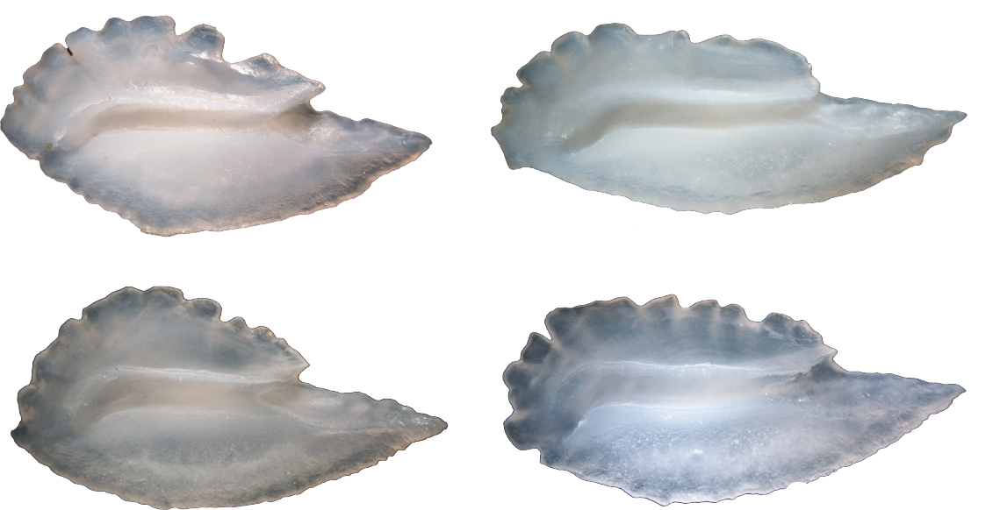

## About this tutorial

The tutorial describes options for identifying otolith phenotypes and suggests evaluating stocks by assessing their phenotypic composition and variability (Tuset et al., 2019; Vasconcelos et al., 2021, 2025a,b; Jurado-Ruzafa et al., 2024). Use the wavelet at 4^th^ scale and test several options.

## **1. Natural variability**

Populations contain specimens with different phenotypes. Stock differences can reflect the relative abundance of these phenotypes, which can vary seasonally; hence, monthly sampling is advised.

In pelagic fishes, such as *Trachurus trachurus*, elongated shapes seems to be linked to exhibiting high swimming activity.

{style="display:block; margin-left:auto; margin-right:auto;" width="13cm"}

## **2. Methods**

Users can used optClust and NbClust packages, and to test different options. Here presented the results using hierarchical clustering.

``` r
res<-NbClust([,1:27], distance = "manhattan", min.nc = 2, max.nc = 8,
             method = "kmeans", index = "kl")
res$Best.partition<-as.factor(res$Best.partition)
res$Best.nc
Group<-as.data.frame(res$Best.partition)
TT<-as.data.frame(cbind(DataT1, Group))
```
